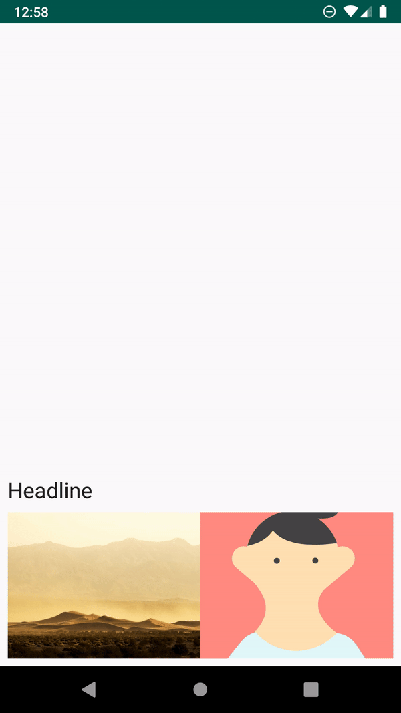
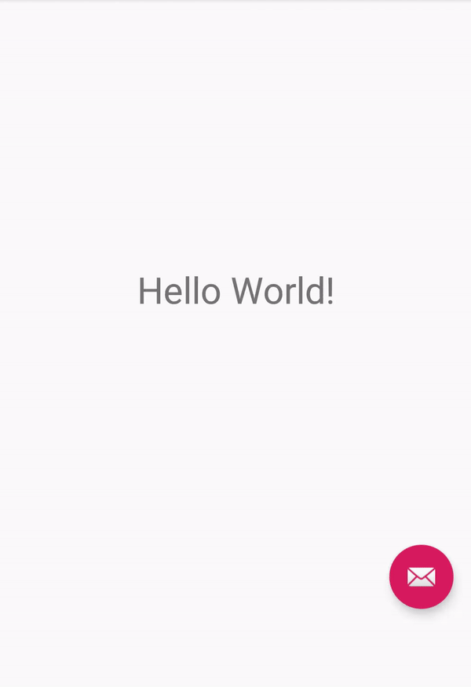

# Constraint Layout Animations and Performance
Code presented in Android Meetup hosted by Tokopedia India

There are 2 Branches here. 
- #Master branch - Contains code for constraint layout animations
- #constraintlayoutperf - profiling of layout

Below are the gifs.
all of them respond to click except the last one (Simple Parallax) which is also responds to drag and click. You can drag the screen as well as clickon the small profile image

For any doubt you can drop an email at pranaym143@gmail.com

**Simple Open Animation** 

**Simple Open Animation with Fab button circular open**

**Placeholder and Constraint Set Animation**

**Simple Guideline Anim with Parallax**

